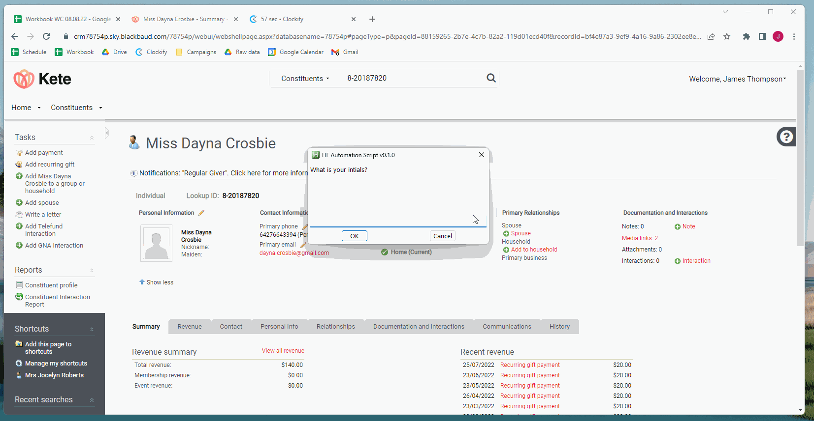
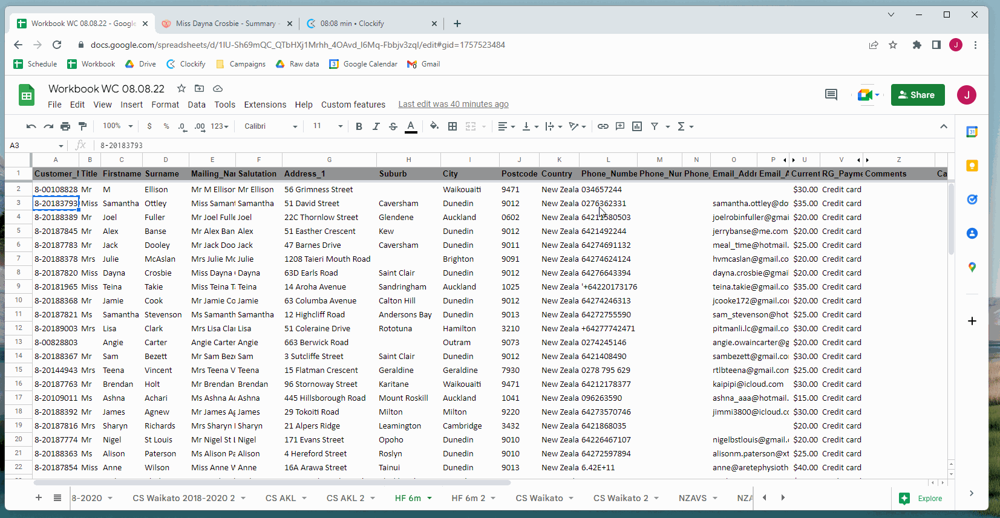

# HF Automation
Automate the process of filling out the HF interactactions in Kete.

Any queries about this can prefeably be put in the issues section if appropriate or emailed to jamestelefund@gmail.com

## User Guide

### Installation
#### Download
1. Navigate to the releases and find the latest one
2. Press on HF_automation.zip
3. Find the ZIP file in your downloads.
4. Extract it to the location you want it to. (You can always drag the folder at a later date)
Here is a short video showing the process:

#### First time Setup
1. Navigate in the folder to the HF_automation.exe or press windows key and start typing HF_Automation.exe (press it when you see it)
2. Put in your initials
3. Follow prompt and press on search bar
4. Follow prompt and pres on interaction
Thats it is now setup. Here is a run through of that.

### Usage
#### Setup
At the start of each shift or whenver you want to start using it:
1. run the .exe file. (either by finding it or searching it up)
2. Enter the campaign. Either 6, 18, 30
It is now ready to go.
#### Using
1. Press Alt key
2. Sit back and wait for it to do its thing  
It will stop before it actually enters the interaction into Kete  
Some things to remember (**Requirements**)
 - You need to be on the upgrade amount column when presing insert regardless of whether it is a conversion or not.
 - The Kete tab need to be the right of the workbook everytime you want to use the script.
 - If you are looking at the kete tab you should be able to see the interaction button as well as the search bar at the same time. It is easy to do as long as you dont have a silly small window.
 - It is built off of a 1920x1080 screen so your screen needs to be this size. You might be having scaling issues so check setting on your computer.  
Here is a screenshot to show you the requirements:

Ignore the black marks as they are put there for privacy reasons. The highlighted parts are what is important.

#### Example
Here is an exmaple of it in action (A NTC for HF6m):

## Contributer Guide

### Commit messages
They will be sorted into a category with these emojis found below

➕ `:heavy_plus_sign:` when adding a file or implementing a feature 
🔨 `:hammer:` when fixing a bug or issue 
📜 `:scroll:` when updating docs, readme or comments 
✅ `:white_check_mark:` when a release is made 
👕 `:shirt:` when refactoring or removing linter warnings 
❌ `:x:` when removing code or files 

### Versioning
I am using semantic versioning. No originality here just using the guidelines found at https://semver.org/.  
In short, this will mean Major will be big updates. Minor are any updates that aren't too big and also arent backward compatible. Lastly, patches are simple fixes that are not required but might fix a little behaviour. Always should be backward compatible.
